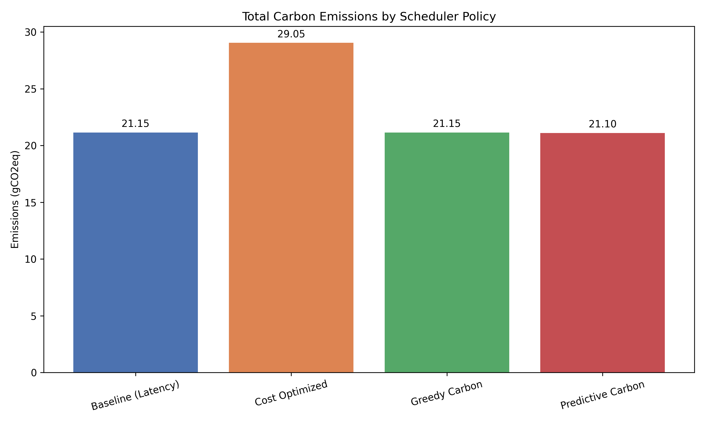
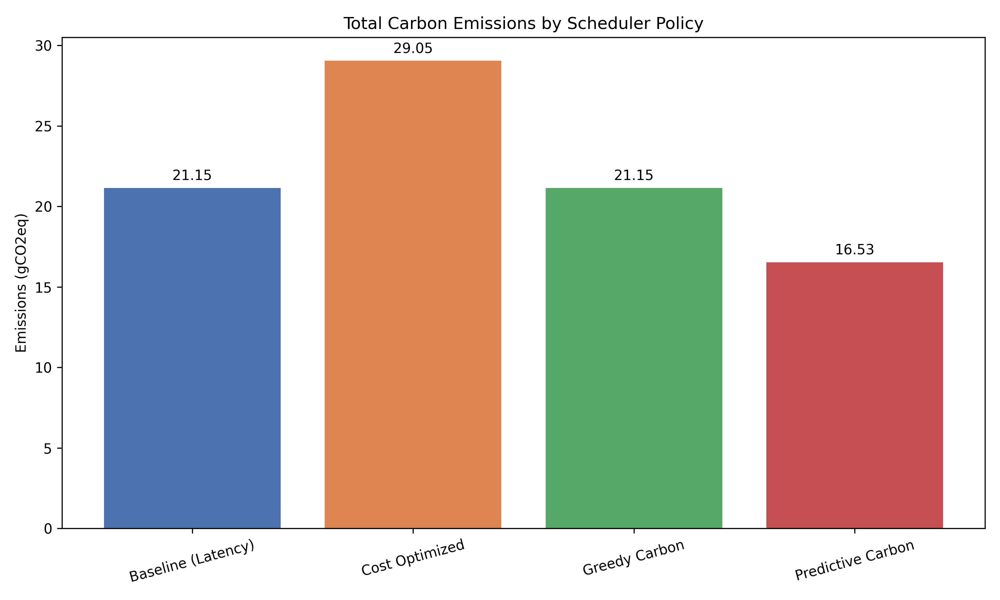

# Predictive Carbon-Aware Scheduling: SLA Sensitivity Analysis

This research project explores the optimization of carbon emissions for multi-region serverless workloads. Using **Deep Learning (PyTorch LSTM)**, the framework predicts grid carbon intensity to determine the optimal balance between **Spatial Shifting** (moving jobs to cleaner regions) and **Temporal Shifting** (delaying jobs until the grid is cleaner).

## Project Overview

As cloud computing expands, its environmental impact becomes critical. This project demonstrates a **Predictive Carbon-Aware Scheduler** designed to proactively reduce the carbon footprint of serverless functions. 

The core research focus is **SLA Sensitivity Analysis**: understanding how much carbon we can save if we are allowed to delay non-urgent jobs by 1, 6, 12, or 24 hours.

## Architecture & Project Structure

The project is built as a modular simulation environment:

- **`data/`**: Logic for processing the 300MB+ **Azure Functions (2021)** trace logs and historical **Electricity Maps (2021-2025)** grid carbon data.
- **`models/`**: Contains the **PyTorch LSTM** forecasting logic with Early Stopping and recursive multi-step prediction capabilities.
- **`simulator/`**: An event-driven simulation engine that models job queues, execution latencies, and regional grid intensities.
    - `config.py`: **Main Configuration**. Define your cloud regions and global SLA baseline here.
- **`scheduler/`**: Implements four distinct decision policies:
    - `LatencyOptimized`: Baseline (nearest region, zero delay).
    - `CostOptimized`: Minimum financial cost (lowest `cost_multiplier`).
    - `GreedyCarbon`: Minimum carbon based on *current* real-time metrics.
    - `PredictiveCarbonAware`: Uses ML forecasts to find the absolute carbon minimum within a future SLA window.
- **`evaluation/`**: Orchestrates the SLA Sensitivity benchmarks and computes KPIs.
- **`visualization/`**: Generates comparative Pareto Fronts and Emissions Bar charts for different SLA thresholds.

## Customization

You can dynamically adjust the research parameters in `simulator/config.py`:
- **Add Regions**: Add new zones to the `REGIONS` map.
- **Inject History**: Drop hourly CSVs from Electricity Maps into `data/Historical Data/`. The system uses dynamic glob loading to automatically link files to regions.

## Benchmarks & Results

The current evaluation suite executes a sensitivity analysis across four Service Level Agreements (SLAs): **1h, 6h, 12h, and 24h**. 

The results demonstrate that while **Spatial Shifting** (Greedy) is powerful, **Predictive Temporal Shifting** becomes the dominant factor in carbon reduction as SLAs become more flexible.

| SLA: 1 Hour | SLA: 12 Hours |
|:---:|:---:|
|  |  |

| SLA: 6 Hours | SLA: 24 Hours |
|:---:|:---:|
|  |  |

## Setup & Execution

### Option A: Docker (Recommended)

Build and run the entire project with a single command — no manual dependency installation required. The Docker image automatically unzips the Azure dataset during build.

```bash
# Build the image
docker build -t carbon-scheduler .

# Train the LSTM models
docker run --rm -v "$(pwd)/models/saved:/app/models/saved" carbon-scheduler python3 train_models.py

# Run the SLA Sensitivity benchmarks
docker run --rm -v "$(pwd)/results:/app/results" carbon-scheduler

# Or run both training + evaluation in one go
docker run --rm \
  -v "$(pwd)/models/saved:/app/models/saved" \
  -v "$(pwd)/results:/app/results" \
  carbon-scheduler sh -c "python3 train_models.py && python3 evaluation/runner.py"
```

> **Note:** The `-v` volume mounts ensure that trained models and result charts are saved back to your host machine.

### Option B: Local Setup

#### 1. Requirements
```bash
python3 -m venv venv
source venv/bin/activate
pip install -r requirements.txt
```

#### 2. Prepare Data
- Unzip `data/azure_dataset.zip` (compressed due to GitHub's 100MB limit).
- Ensure historical CSVs are present in `data/Historical Data/`.

#### 3. Training
Train the LSTM models on the multi-year history (includes Early Stopping):
```bash
python3 train_models.py
```

#### 4. Running Benchmarks
Run the SLA Sensitivity suite:
```bash
python3 evaluation/runner.py
```
*Charts and metrics for 1h, 6h, 12h, and 24h will be automatically saved to the `results/` folder.*