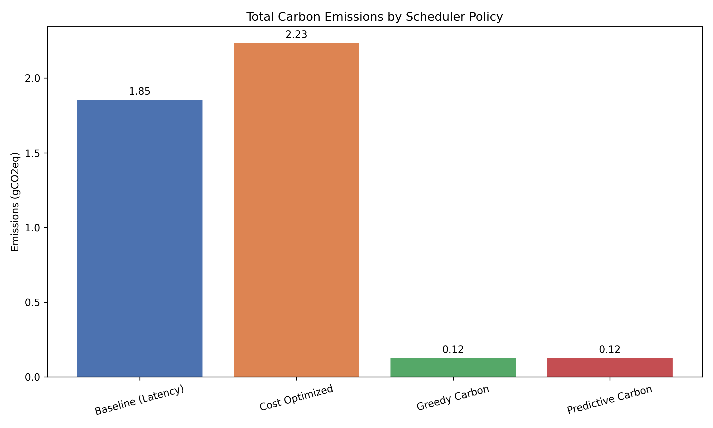
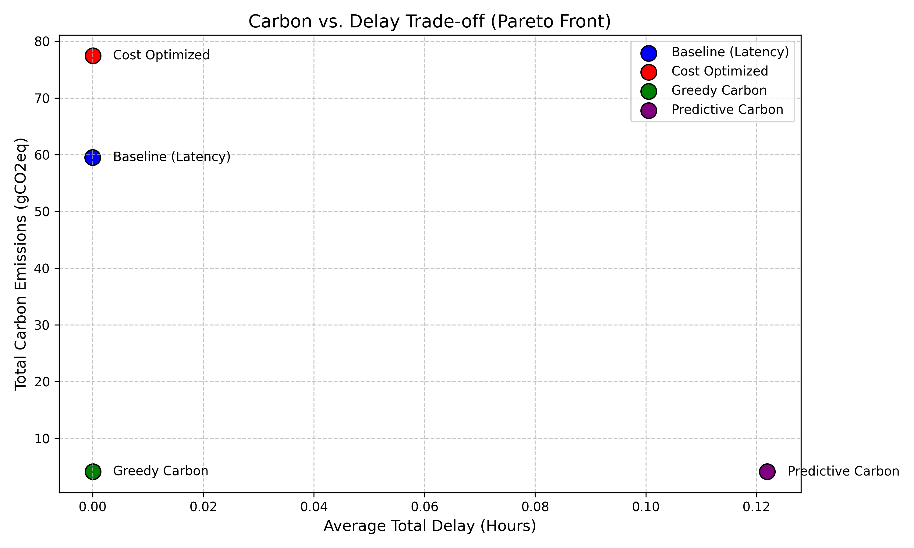
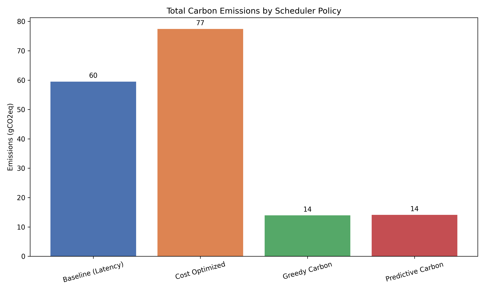
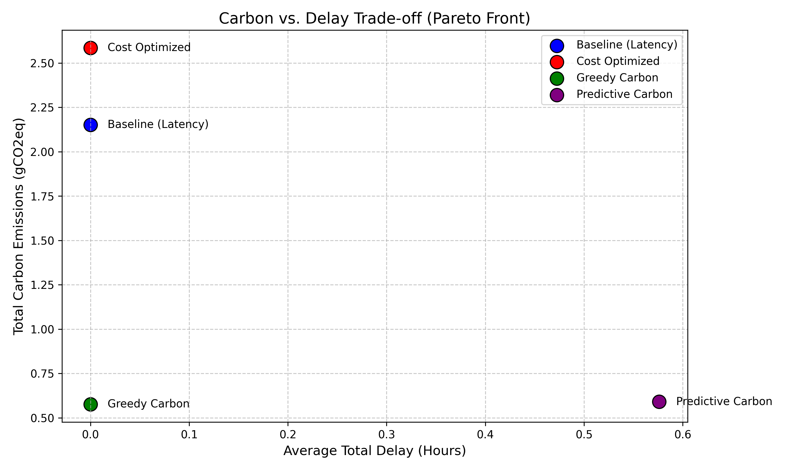

# Predictive Carbon-Aware Scheduling for Multi-Region Serverless Workloads

This project implements a research-grade simulation framework for optimizing carbon emissions in multi-region serverless environments. It leverages Deep Learning (PyTorch LSTM) to forecast grid carbon intensity and make intelligent scheduling decisions based on both geographic (spatial) and temporal shifting.

## Project Overview

Serverless computing offers scalability but often ignores the environmental impact of where and when code is executed. This project demonstrates how a **Predictive Carbon-Aware Scheduler** can significantly reduce the carbon footprint of cloud workloads by:
1. **Spatial Shifting**: Routing jobs to the cleanest available region in real-time.
2. **Temporal Shifting**: Delaying non-urgent jobs to periods when the grid is cleaner (e.g., peak solar/wind hours).

## Architecture & Project Structure

The repository is organized into modular components:

- **`data/`**: Handles data ingestion and loading.
    - `data_loader.py`: Processes the 300MB+ Azure Function trace logs.
    - `electricity_maps_client.py`: API client for live grid data (production fallback).
    - `Historical Data/`: Local storage for multi-year (2021-2025) CSV carbon datasets.
- **`models/`**: Contains the AI logic.
    - `forecaster.py`: Defines the `LSTMForecaster` PyTorch model and training wrapper.
- **`simulator/`**: Core simulation physics.
    - `config.py`: **Main Configuration**. Add custom regions, define `electricity_maps_zones`, and map them to historical datasets here.
    - `environment.py`: Models the cloud environment and handles carbon intensity lookups.
    - `job_queue.py`: Manages event-driven job execution timing.
- **`scheduler/`**: Contains the 4 logic policies (`policies.py`).
- **`evaluation/`**: Running the benchmarks.
    - `runner.py`: The main orchestrator for simulations.
    - `metrics.py`: Computes KPIs like gCO2eq/job and temporal delay.
- **`visualization/`**: Generates the Pareto Front and Emission Bar charts.
- **`train_models.py`**: Standalone script to pre-train LSTM models on historical data.

## Customization

You can easily extend this project with new data:
1. **Add new regions**: In `simulator/config.py`, add a new entry to the `REGIONS` dictionary.
2. **Add data**: Place corresponding historical CSVs from Electricity Maps into `data/Historical Data/`. The system uses dynamic glob loading to link datasets to regions.
3. **Adjust SLAs**: Modify `SLA_MAX_DELAY_HOURS` in `config.py` to test different latency requirements.

## Benchmarks

We have evaluated the system across two primary scenarios:

1. **Multi-Zone Global Benchmark**: Evaluating the trade-off when high-cleanliness regions (like Sweden) are available globally.
2. **Single Continent (US-Only) Benchmark**: Simulating data residency constraints (GDPR-like) where the scheduler must rely on temporal shifting within a specific geographical boundary.

|  |  |
|:---:|:---:|
| **Multi-Zone Emissions** | **Multi-Zone Pareto Front** |

|  |  |
|:---:|:---:|
| **US-Only Emissions** | **US-Only Pareto Front** |

## Setup

### 1. Prerequisites
- Python 3.9+
- `pip install -r requirements.txt`

### 2. Prepare Data
Ensure your historical carbon data is placed in `data/Historical Data/`. 

**Note on Azure Traces**: Due to GitHub's 100MB file size limit, the primary Azure dataset has been compressed into `data/azure_dataset.zip`. You **must** unarchive/unzip this file into the `data/azure_dataset/` directory before running the simulation for the first time.

### 3. Setup Environment
Create a `.env` file and add your API key if you wish to fetch live data (optional for simulation):
```env
ELECTRICITY_MAPS_API_KEY=your_key_here
```

### 4. Training the Models
Before running the simulation, train the PyTorch LSTM models on the multi-year history:
```bash
python3 train_models.py
```
*This will train the models for 150 epochs and save them to `models/saved/`.*

### 5. Running the Simulation
Run the evaluation suite to generate metrics and visualization plots:
```bash
python3 evaluation/runner.py
```